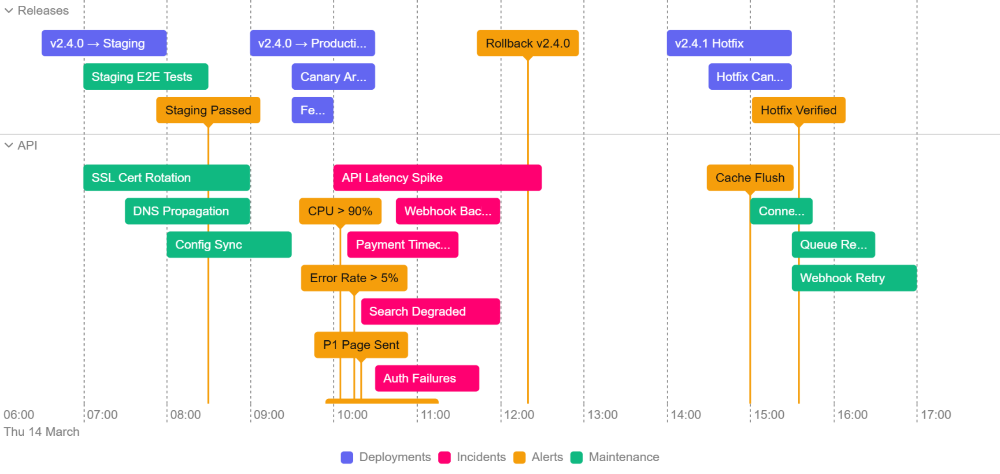

<p align="center">
  
</p>

<h1 align="center">Tempis</h1>

<p align="center">
  A fast, zero-dependency, canvas-rendered timeline library.<br>
  Handles thousands of items, touch &amp; keyboard input, RTL, image export, and more.
</p>

<p align="center">
  
  
  
  
</p>

---

<p align="center">
  <br>
  
</p>

## Highlights

🔷 **Virtualised Canvas Rendering** – no DOM nodes per item, smooth performance for thousands of items<br>
🔷 **Range & Point-in-Time Items** – horizontal bars and milestone markers with automatic stacking<br>
🔷 **Categories & Interactive Legend** – colour-code items, filter on click, highlight on hover<br>
🔷 **Collapsible Groups** – click headers to collapse swimlanes, programmatic control via API<br>
🔷 **Item Dependencies** – finish-to-start connector arrows with automatic routing and styling<br>
🔷 **Per-Item Styling** – override colours, borders, dash patterns, and radius on individual items<br>
🔷 **Progress Indicator** – show completion as a fill bar inside range items<br>
🔷 **Custom Tooltips** – rich HTML templates with overflow handling and conditional display<br>
🔷 **Selection Modes** – none, single, or multi-select with controlled and uncontrolled patterns<br>
🔷 **Animated Focus** – pan and zoom to any item, date, or range with configurable easing<br>
🔷 **Touch & Keyboard** – pinch-to-zoom, arrow key navigation, and full accessibility support<br>
🔷 **Timeline Bands** – highlight time ranges or mark deadlines with background regions and lines<br>
🔷 **Minimap** – compact overview bar with click/drag navigation for large timelines<br>
🔷 **RTL Layout** – full right-to-left support for Arabic, Hebrew, and other RTL languages<br>
🔷 **Image Export** – download as PNG, JPEG, or WebP with DPR and background colour control<br>
🔷 **Date Adapters** – plug in Luxon, Day.js, or any library for timezone and locale support<br>
🔷 **React Wrapper** – declarative props, reactive data, imperative ref API, automatic cleanup<br>
🔷 **Vue Wrapper** – v-model selection, reactive props, template ref API, automatic cleanup<br>
🔷 **Accessibility** – keyboard navigation, ARIA attributes, and automatic reduced motion support<br>
🔷 **TypeScript-First** – full type definitions, IntelliSense, and typed callbacks out of the box

## Packages

| Package | Description |
|---------|-------------|
| [`@tempis/timeline`](packages/tempis-timeline) | Core timeline library — canvas rendering, interactions, adapters |
| [`@tempis/react`](packages/tempis-react) | React wrapper with declarative props, reactive data, and imperative ref API |
| [`@tempis/vue`](packages/tempis-vue) | Vue 3 wrapper with v-model selection, reactive props, and template ref API |

## Quick Start

```bash
npm install @tempis/timeline
```

```typescript
import { TempisTimeline } from '@tempis/timeline';

const timeline = new TempisTimeline('#canvas', {
  responsive: true,
  items: [
    { id: 1, label: 'Design',  start: '2026-01-05', end: '2026-01-15', grouping: 'Frontend' },
    { id: 2, label: 'Build',   start: '2026-01-12', end: '2026-01-28', grouping: 'Frontend' },
    { id: 3, label: 'Launch',  start: '2026-01-30', grouping: 'Frontend' },
    { id: 4, label: 'API',     start: '2026-01-08', end: '2026-01-25', grouping: 'Backend' },
  ],
  range: { start: '2026-01-01', end: '2026-02-01', position: 'bottom' }
});
```

Or via CDN:

```html
<script src="https://unpkg.com/@tempis/timeline/dist/tempis_timeline.min.js"></script>
<script>
  new tempis_timeline.TempisTimeline('#canvas', { /* ... */ });
</script>
```

## Repo Structure

```
tempis/
├── packages/
│   ├── tempis-timeline/   Core library
│   ├── tempis-react/      React wrapper
│   └── tempis-vue/        Vue 3 wrapper
├── examples/              Interactive HTML demos
├── site/                  Documentation site
├── scripts/               Build tooling
├── lib/                   Dev build output
└── dist/                  Distribution output
```

## Development

```bash
npm install
npm run dev          # Watch + dev server on :8080
npm run build        # Build all packages
npm test             # Lint + unit tests
```

## Examples

The [`examples/`](examples/) directory has interactive demos covering basic usage, dashboards, dependencies, progress indicators, real-time streaming, custom tooltips, RTL, image export, and more. Run `npm run dev` and browse them at `http://localhost:8080/examples/`.

You can also view them online at [tempis.dev/examples](https://tempis.dev/examples.html).

## Licence

Free for personal projects, education, and evaluation. A paid licence is required for commercial use where revenue is generated. See [LICENSE](LICENSE) for full terms.

## Need Help?

Do you have a question or have you found a bug? Open an issue or start a discussion on the [Tempis GitHub repository](https://github.com/tempis-dev/tempis).
