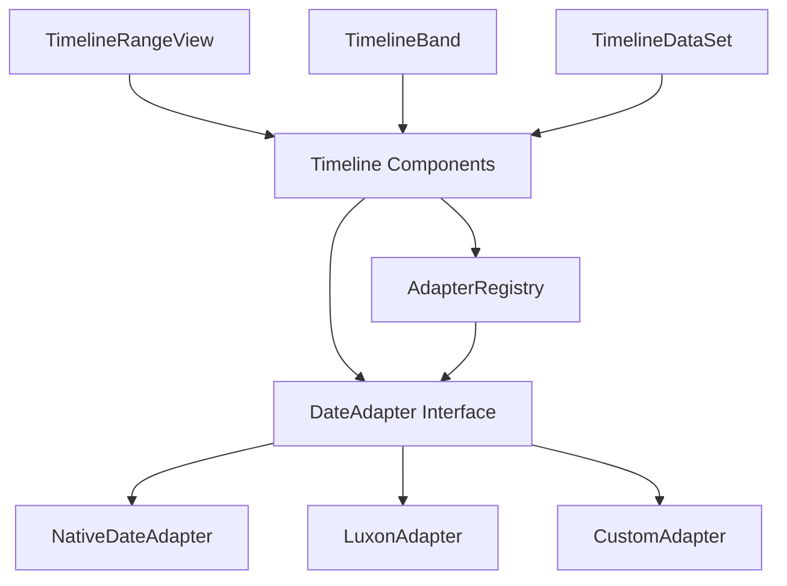

# Design Document: Date Adapter Interface

## Overview

The date adapter interface introduces an abstraction layer between the Timeline Library's core logic and datetime operations. This design addresses the fundamental issue that native JavaScript Date objects perform calendar calculations in the browser's timezone, causing incorrect rendering when visualizing events from different timezones.

The solution treats dates as point-in-time values (milliseconds since epoch) and delegates all calendar-aware operations to pluggable adapter implementations. This allows users to integrate timezone-aware libraries (like Luxon, date-fns-tz, or Temporal) while maintaining a default adapter for users who don't need timezone support.

### Why the Minimal Interface is Sufficient

The 4-method interface covers all operations the timeline actually needs:

1. **parse()**: Convert user input (Date, string, number) to timestamps
2. **startOf()**: Calculate calendar boundaries (start of day, month, year, etc.)
3. **add()**: Calendar arithmetic (add months, days, hours - DST and month-length aware)
4. **format()**: Display timestamps as formatted strings

**Operations that don't need adapter methods:**
- **Comparison** (`timestampA < timestampB`): Use JavaScript operators directly
- **Duration** (`endTime - startTime`): Subtract timestamps directly
- **Equality** (`timestampA === timestampB`): Use strict equality
- **Sorting** (`timestamps.sort((a, b) => a - b)`): Use standard array methods

This minimal design eliminates 20+ unnecessary methods from earlier proposals while providing complete functionality for the timeline's needs.

### Comparison with Over-Engineered Alternatives

Earlier proposals included 24+ methods like:
- `equals()`, `isBefore()`, `isAfter()` - **Unnecessary**: Use `===`, `<`, `>` directly
- `diff()` - **Unnecessary**: Just subtract timestamps
- `subtract()` - **Unnecessary**: Use `add()` with negative amount
- `endOf()` - **Unnecessary**: Can derive from `startOf()` if needed
- `getYear()`, `getMonth()`, `getDay()`, etc. - **Unnecessary**: Timeline doesn't extract components
- `setDefaultTimezone()`, `setWeekStartDay()` - **Unnecessary**: Constructor parameters

The minimal 4-method interface provides the same functionality with:
- 83% fewer methods
- No performance overhead for comparisons and duration calculations
- Simpler implementation for custom adapters
- Clearer separation: adapter for calendar operations, native JS for everything else

### Design Goals

1. **Zero Breaking Changes**: Existing timeline code continues working with the default adapter
2. **Minimal Integration Surface**: 4-method interface covers only operations the timeline actually needs
3. **Performance**: Direct timestamp operations (comparison, arithmetic) don't need adapter overhead
4. **Type Safety**: Strong typing for adapter methods and return values
5. **Simplicity**: No over-engineering - just what's needed, nothing more

## Architecture

### Component Structure



The architecture is intentionally simple:
- **AdapterRegistry**: Static class for registration (no singleton complexity)
- **TimelineDateAdapter**: 4-method interface (no bloat)
- **Implementations**: Only implement what's needed (parse, startOf, add, format)
- **Timeline Components**: Use adapter for calendar operations, native JS for comparisons/arithmetic

### Integration Points

The adapter integrates at these key locations in the existing codebase:

1. **TimelineRangeView._getTickDates()**: Replace hardcoded date arithmetic with `adapter.startOf()` and `adapter.add()`
2. **DateFormatter**: Use `adapter.format()` instead of date-format-parse
3. **Utilities.parseDate()**: Delegate to `adapter.parse()`
4. **Date comparisons**: Use direct timestamp comparison (`<`, `>`, `===`) - no adapter needed
5. **Canvas calculations**: Use direct timestamp arithmetic - no adapter needed

### Adapter Lifecycle

1. **Initialization**: AdapterRegistry is a static class, no instantiation needed
2. **Registration**: User optionally registers custom adapter via `Timeline.registerDateAdapter(adapter)`
3. **Validation**: Basic runtime validation ensures all 4 methods exist
4. **Usage**: Timeline components access adapter via `Timeline.getDateAdapter()`
5. **Fallback**: If no adapter registered, NativeDateAdapter is lazily created on first use

## Components and Interfaces

### TimelineDateAdapter Interface

```typescript
export type DateInput = Date | string | number;
export type TimeInstant = number; // epoch milliseconds
export type Unit = 'year' | 'month' | 'week' | 'day' | 'hour' | 'minute' | 'second' | 'millisecond';

/**
 * Minimal adapter required by TimelineRangeView.
 * 
 * All methods operate on instants represented as epoch milliseconds.
 * Calendar semantics (local vs specific TZ) are defined by the adapter implementation.
 */
export interface TimelineDateAdapter {
  /**
   * Parse a user-provided value (Date | ISO string | epoch ms) into an instant (epoch ms).
   * Return null if unparseable.
   */
  parse(input: DateInput): TimeInstant | null;

  /**
   * Snap an instant down to the start of the given unit (in the adapter's calendar).
   * Example: startOf(instant, "day") => midnight at start of that day (in adapter TZ/local calendar).
   */
  startOf(instant: TimeInstant, unit: Unit): TimeInstant;

  /**
   * Add calendar units in the adapter's calendar.
   * Example: add(instant, "month", 1) => same local wall-clock time next month (DST-safe per adapter rules).
   */
  add(instant: TimeInstant, unit: Unit, amount: number): TimeInstant;

  /**
   * Format an instant for display using your existing pattern strings
   * (SSS, HH:mm, MMM, YYYY, etc.), interpreted in adapter TZ/local calendar.
   */
  format(instant: TimeInstant, pattern: string): string;
}
```

**Design Rationale:**

This minimal interface covers all operations the timeline actually needs:
- **parse()**: Handles all input types (Date, string, number) in one method
- **startOf()**: Calendar boundary calculations (heavily used in `_getTickDates()`)
- **add()**: Date arithmetic (also in `_getTickDates()`)
- **format()**: Display formatting

Operations that don't need adapter methods:
- **Comparison** (`equals`, `isBefore`, `isAfter`): Use direct timestamp comparison (`<`, `>`, `===`)
- **Component extraction** (`getYear`, `getMonth`, etc.): Timeline doesn't use these
- **subtract()**: Just `add()` with negative amount
- **diff()**: Just subtract timestamps directly
- **endOf()**: Can be derived from `startOf()` of next unit if needed
- **Configuration** (`setDefaultTimezone`, `setWeekStartDay`): Constructor params or adapter-specific

### AdapterRegistry

Simple registration mechanism without over-engineering:

```typescript
class AdapterRegistry {
  private static adapter: TimelineDateAdapter | null = null;
  
  static register(adapter: TimelineDateAdapter): void {
    // Basic validation - TypeScript handles the rest
    if (!adapter || typeof adapter.parse !== 'function' || 
        typeof adapter.startOf !== 'function' || 
        typeof adapter.add !== 'function' || 
        typeof adapter.format !== 'function') {
      throw new Error('Invalid adapter: must implement parse, startOf, add, and format methods');
    }
    AdapterRegistry.adapter = adapter;
  }
  
  static get(): TimelineDateAdapter {
    if (!AdapterRegistry.adapter) {
      AdapterRegistry.adapter = new NativeDateAdapter();
    }
    return AdapterRegistry.adapter;
  }
  
  // For testing
  static reset(): void {
    AdapterRegistry.adapter = null;
  }
}
```

**Design Rationale:**
- No singleton pattern complexity - just static methods
- Minimal validation - TypeScript interface provides compile-time safety
- Simple lazy initialization of default adapter
- Reset method for test isolation

### NativeDateAdapter

```typescript
class NativeDateAdapter implements TimelineDateAdapter {
  parse(input: DateInput): TimeInstant | null {
    // Handle number (already a timestamp)
    if (typeof input === 'number') {
      return isNaN(input) ? null : input;
    }
    
    // Handle Date object
    if (input instanceof Date) {
      const timestamp = input.getTime();
      return isNaN(timestamp) ? null : timestamp;
    }
    
    // Handle string
    if (typeof input === 'string') {
      const date = new Date(input);
      const timestamp = date.getTime();
      return isNaN(timestamp) ? null : timestamp;
    }
    
    return null;
  }
  
  startOf(instant: TimeInstant, unit: Unit): TimeInstant {
    const date = new Date(instant);
    
    switch (unit) {
      case 'year':
        date.setMonth(0, 1);
        date.setHours(0, 0, 0, 0);
        break;
      case 'month':
        date.setDate(1);
        date.setHours(0, 0, 0, 0);
        break;
      case 'week':
        // Week starts on Sunday (0)
        const day = date.getDay();
        date.setDate(date.getDate() - day);
        date.setHours(0, 0, 0, 0);
        break;
      case 'day':
        date.setHours(0, 0, 0, 0);
        break;
      case 'hour':
        date.setMinutes(0, 0, 0);
        break;
      case 'minute':
        date.setSeconds(0, 0);
        break;
      case 'second':
        date.setMilliseconds(0);
        break;
      case 'millisecond':
        return instant;
      default:
        throw new Error(`Unknown time unit: ${unit}`);
    }
    
    return date.getTime();
  }
  
  add(instant: TimeInstant, unit: Unit, amount: number): TimeInstant {
    const date = new Date(instant);
    
    switch (unit) {
      case 'year':
        date.setFullYear(date.getFullYear() + amount);
        break;
      case 'month':
        date.setMonth(date.getMonth() + amount);
        break;
      case 'week':
        date.setDate(date.getDate() + (amount * 7));
        break;
      case 'day':
        date.setDate(date.getDate() + amount);
        break;
      case 'hour':
        date.setHours(date.getHours() + amount);
        break;
      case 'minute':
        date.setMinutes(date.getMinutes() + amount);
        break;
      case 'second':
        date.setSeconds(date.getSeconds() + amount);
        break;
      case 'millisecond':
        return instant + amount;
      default:
        throw new Error(`Unknown time unit: ${unit}`);
    }
    
    return date.getTime();
  }
  
  format(instant: TimeInstant, pattern: string): string {
    const date = new Date(instant);
    // Delegate to existing DateFormatter
    return new DateFormatter(pattern).format(date);
  }
}
```

### Public API

```typescript
// Timeline.ts - Add static method for adapter registration
class Timeline {
  static registerDateAdapter(adapter: TimelineDateAdapter): void {
    AdapterRegistry.register(adapter);
  }
  
  static getDateAdapter(): TimelineDateAdapter {
    return AdapterRegistry.get();
  }
}
```

## Data Models

### Point-in-Time Representation

All dates are stored as `number` (milliseconds since Unix epoch). This provides:
- **Timezone-independent storage**: Timestamps are absolute points in time
- **Efficient comparison**: Use standard JavaScript operators directly (`<`, `>`, `===`, `<=`, `>=`)
- **Efficient arithmetic**: Subtract timestamps to get duration in milliseconds
- **Compatibility**: Works with existing Date.getTime() usage
- **Serialization**: JSON-safe without data loss

**Key Insight**: By storing everything as numbers, we eliminate the need for adapter methods for comparison and duration calculations. The adapter is only needed for calendar-aware operations (boundaries, arithmetic, formatting).

```typescript
// Comparison - no adapter needed
if (timestampA < timestampB) { /* A is earlier */ }
if (timestampA === timestampB) { /* same instant */ }

// Duration - no adapter needed
const durationMs = timestampB - timestampA;
const durationDays = durationMs / (24 * 60 * 60 * 1000);

// Calendar operations - adapter needed
const adapter = Timeline.getDateAdapter();
const startOfDay = adapter.startOf(timestamp, 'day');
const nextMonth = adapter.add(timestamp, 'month', 1);
```

### Unit Enumeration

```typescript
type Unit = 
  | 'year' 
  | 'month' 
  | 'week' 
  | 'day' 
  | 'hour' 
  | 'minute' 
  | 'second' 
  | 'millisecond';
```

### Migration Strategy

Existing code using Date objects:
```typescript
// Before
const date = new Date();
date.setMonth(date.getMonth() + 1);
const nextMonth = date.getTime();
```

After adapter integration:
```typescript
// After
const adapter = Timeline.getDateAdapter();
const timestamp = Date.now();
const nextMonth = adapter.add(timestamp, 'month', 1);
```

**Comparison operations are simpler** - no adapter needed:
```typescript
// Direct timestamp comparison (no adapter)
if (timestampA < timestampB) { /* A is earlier */ }
if (timestampA > timestampB) { /* A is later */ }
if (timestampA === timestampB) { /* same instant */ }

// Duration calculation (no adapter)
const durationMs = endTime - startTime;
```

**Only calendar operations need the adapter**:
```typescript
const adapter = Timeline.getDateAdapter();

// Calendar boundaries
const startOfDay = adapter.startOf(timestamp, 'day');

// Calendar arithmetic (DST-safe, month-length-aware)
const nextMonth = adapter.add(timestamp, 'month', 1);

// Display formatting
const label = adapter.format(timestamp, 'MMM DD, YYYY');
```

The migration is incremental - existing Date usage continues working until replaced with adapter calls.


## Correctness Properties

*A property is a characteristic or behavior that should hold true across all valid executions of a system—essentially, a formal statement about what the system should do. Properties serve as the bridge between human-readable specifications and machine-verifiable correctness guarantees.*

### Property Reflection

After analyzing all acceptance criteria for the minimal 4-method interface, I identified these testable properties. The minimal interface eliminates redundancy by design:

**What doesn't need adapter methods:**
- **Comparison operations** (`<`, `>`, `===`, `<=`, `>=`): Direct timestamp comparison
- **Duration calculations** (`endTime - startTime`): Direct timestamp arithmetic
- **Component extraction** (getYear, getMonth, etc.): Timeline doesn't need these
- **subtract()**: Just `add()` with negative amount - covered by add() properties
- **endOf()**: Can be derived from `startOf()` of next unit if needed

**What the adapter provides:**
- **parse()**: Convert various input types to timestamps
- **startOf()**: Calendar boundary calculations (timezone/DST-aware)
- **add()**: Calendar arithmetic (handles month lengths, DST, leap years)
- **format()**: Display formatting in the adapter's calendar

This leaves 8 focused properties for the 4 essential methods.

### Property 1: Adapter Registration and Retrieval

*For any* valid adapter implementation, when registered via `Timeline.registerDateAdapter()`, subsequent calls to `Timeline.getDateAdapter()` should return that same adapter instance.

**Validates: Requirements 2.3**

### Property 2: Adapter Validation Rejects Incomplete Implementations

*For any* object missing one or more of the 4 required methods (parse, startOf, add, format), attempting to register it should throw an error that identifies which method is missing.

**Validates: Requirements 2.4, 2.5**

### Property 3: Parse Handles Multiple Input Types

*For any* valid Date object, parsing it should return the same timestamp as calling `.getTime()` on that Date object.

**Validates: Requirements 5.1**

### Property 4: Parse Round-Trip with Format

*For any* valid timestamp, formatting it with a pattern and then parsing the result should produce a timestamp that represents the same calendar date/time (may differ by precision based on pattern).

**Validates: Requirements 5.5**

### Property 5: Parse Returns Null for Invalid Input

*For any* invalid date input (malformed string, NaN, invalid Date), `parse()` should return `null` rather than throwing an error.

**Validates: Requirements 5.3, 10.2**

### Property 6: StartOf Returns Earlier or Equal Timestamp

*For any* valid timestamp and time unit, `startOf(timestamp, unit)` should return a value less than or equal to the original timestamp.

**Validates: Requirements 8.1**

### Property 7: StartOf Is Idempotent

*For any* valid timestamp and time unit, calling `startOf()` twice should return the same result: `startOf(startOf(timestamp, unit), unit) === startOf(timestamp, unit)`.

**Validates: Requirements 8.2**

### Property 8: Add-Subtract Inverse Relationship

*For any* valid timestamp, amount, and time unit, `add(add(timestamp, unit, amount), unit, -amount)` should return a timestamp equal to the original (within reasonable precision for month/year units which have variable lengths).

**Validates: Requirements 6.1, 6.2**

## Error Handling

### Adapter Validation Errors

When registering an adapter, basic validation ensures all 4 required methods exist:

```typescript
static register(adapter: TimelineDateAdapter): void {
  if (!adapter || typeof adapter.parse !== 'function' || 
      typeof adapter.startOf !== 'function' || 
      typeof adapter.add !== 'function' || 
      typeof adapter.format !== 'function') {
    throw new Error(
      'Invalid adapter: must implement parse, startOf, add, and format methods. ' +
      'See TimelineDateAdapter interface documentation.'
    );
  }
  AdapterRegistry.adapter = adapter;
}
```

TypeScript provides compile-time safety for correctly typed adapters. Runtime validation catches JavaScript usage or dynamic adapter construction.

### Adapter Operation Errors

Each adapter method should validate inputs and provide helpful error messages:

```typescript
// Example: Parse validation
parse(input: DateInput): TimeInstant | null {
  if (input == null) {
    return null; // Graceful handling of null/undefined
  }
  
  // Handle each input type
  if (typeof input === 'number') {
    return isNaN(input) ? null : input;
  }
  
  if (input instanceof Date) {
    const timestamp = input.getTime();
    return isNaN(timestamp) ? null : timestamp;
  }
  
  if (typeof input === 'string') {
    const date = new Date(input);
    const timestamp = date.getTime();
    return isNaN(timestamp) ? null : timestamp;
  }
  
  return null; // Unknown type
}

// Example: Unit validation
add(instant: TimeInstant, unit: Unit, amount: number): TimeInstant {
  if (instant == null || isNaN(instant)) {
    throw new Error('DateAdapter.add: instant must be a valid number');
  }
  
  if (typeof amount !== 'number' || isNaN(amount)) {
    throw new Error('DateAdapter.add: amount must be a valid number');
  }
  
  const validUnits = ['year', 'month', 'week', 'day', 'hour', 'minute', 'second', 'millisecond'];
  if (!validUnits.includes(unit)) {
    throw new Error(`DateAdapter.add: invalid unit "${unit}". Must be one of: ${validUnits.join(', ')}`);
  }
  
  // arithmetic logic
}
```

### Error Propagation

Timeline components should not catch adapter errors - they should propagate to the application level where they can be logged or displayed to users. This ensures that configuration issues (invalid adapters, bad inputs) are immediately visible.

### Graceful Degradation

The timeline should never render in a broken state due to adapter errors. If an adapter operation fails during rendering:

1. Log the error to console
2. Fall back to displaying raw timestamp values
3. Continue rendering other timeline elements

```typescript
// Example: Safe date formatting in rendering code
private formatDateLabel(timestamp: number): string {
  try {
    const adapter = Timeline.getDateAdapter();
    return adapter.format(timestamp, this.labelFormat);
  } catch (error) {
    console.error('Date formatting failed:', error);
    return new Date(timestamp).toISOString(); // Fallback
  }
}
```

## Testing Strategy

### Dual Testing Approach

This feature requires both unit tests and property-based tests:

**Unit Tests** focus on:
- Adapter registration API (specific examples)
- Default adapter instantiation
- Validation error messages for missing methods
- Integration with existing timeline components
- Edge cases like null/undefined inputs, DST transitions
- Specific format patterns

**Property-Based Tests** focus on:
- Round-trip properties (format/parse, add/subtract inverse)
- Invariants (startOf idempotence, startOf <= original timestamp)
- Universal behaviors across all valid inputs
- Parse handling of multiple input types

### Property-Based Testing Configuration

We'll use **fast-check** for TypeScript property-based testing. Each property test should:

- Run minimum 100 iterations (configured via `fc.assert` options)
- Use appropriate arbitraries (fc.integer for timestamps, fc.constantFrom for units)
- Include a comment tag referencing the design property

Example property test structure:

```typescript
import * as fc from 'fast-check';

// Feature: date-adapter-interface, Property 4: Parse Round-Trip with Format
test('format then parse preserves calendar date/time', () => {
  fc.assert(
    fc.property(
      fc.integer({ min: 0, max: 253402300799999 }), // Valid timestamp range
      (timestamp) => {
        const adapter = Timeline.getDateAdapter();
        const formatted = adapter.format(timestamp, 'YYYY-MM-DD HH:mm:ss');
        const parsed = adapter.parse(formatted);
        
        // Should represent same calendar date/time (within second precision)
        expect(Math.abs(parsed - timestamp)).toBeLessThan(1000);
      }
    ),
    { numRuns: 100 }
  );
});

// Feature: date-adapter-interface, Property 7: StartOf Is Idempotent
test('startOf is idempotent', () => {
  fc.assert(
    fc.property(
      fc.integer({ min: 0, max: 253402300799999 }),
      fc.constantFrom('year', 'month', 'week', 'day', 'hour', 'minute', 'second'),
      (timestamp, unit) => {
        const adapter = Timeline.getDateAdapter();
        const once = adapter.startOf(timestamp, unit);
        const twice = adapter.startOf(once, unit);
        expect(once).toBe(twice);
      }
    ),
    { numRuns: 100 }
  );
});

// Feature: date-adapter-interface, Property 8: Add-Subtract Inverse Relationship
test('add then subtract returns to original', () => {
  fc.assert(
    fc.property(
      fc.integer({ min: 0, max: 253402300799999 }),
      fc.constantFrom('day', 'hour', 'minute', 'second', 'millisecond'),
      fc.integer({ min: -1000, max: 1000 }),
      (timestamp, unit, amount) => {
        const adapter = Timeline.getDateAdapter();
        const added = adapter.add(timestamp, unit, amount);
        const subtracted = adapter.add(added, unit, -amount);
        
        // Should return to original (exact for non-calendar units)
        expect(subtracted).toBe(timestamp);
      }
    ),
    { numRuns: 100 }
  );
});

// Feature: date-adapter-interface, Property 3: Parse Handles Multiple Input Types
test('parse handles Date objects correctly', () => {
  fc.assert(
    fc.property(
      fc.integer({ min: 0, max: 253402300799999 }),
      (timestamp) => {
        const adapter = Timeline.getDateAdapter();
        const date = new Date(timestamp);
        const parsed = adapter.parse(date);
        expect(parsed).toBe(timestamp);
      }
    ),
    { numRuns: 100 }
  );
});
```

### Unit Test Coverage

Key unit test scenarios:

1. **Adapter Registration**
   - Register valid adapter, verify it's used
   - Register invalid adapter (missing methods), verify error
   - No adapter registered, verify default NativeDateAdapter is created

2. **NativeDateAdapter Behavior**
   - Parse Date objects, ISO strings, and numbers
   - Parse returns null for invalid inputs (not exceptions)
   - Format with various pattern strings
   - Add/subtract each time unit
   - Calculate startOf for each time unit
   - Handle edge cases (month-end dates, leap years)

3. **Timeline Integration**
   - TimelineRangeView uses adapter for tick calculation
   - DateFormatter uses adapter for formatting
   - Utilities.parseDate delegates to adapter
   - Direct timestamp comparisons work correctly (no adapter needed)
   - Direct timestamp arithmetic works correctly (no adapter needed)

4. **Edge Cases**
   - Month-end dates (Jan 31 + 1 month = Feb 28/29)
   - Leap years
   - DST transitions (if adapter supports timezone)
   - Year boundaries
   - Week boundaries (default Sunday start)
   - Null/undefined inputs to parse()
   - Invalid unit names

### Test Organization

```
tests/
  unit/
    NativeDateAdapter.test.ts    # Default adapter implementation
    AdapterRegistry.test.ts      # Registration and validation
    TimelineIntegration.test.ts  # Timeline component integration
  
  property/
    DateAdapterProperties.test.ts  # All 8 property-based tests
  
  examples/
    LuxonAdapterExample.test.ts    # Example custom adapter with timezone support
```

The simplified interface means less test code while maintaining comprehensive coverage.

### Testing Custom Adapters

Users implementing custom adapters should run the same property tests against their implementation:

```typescript
// Example: Testing a Luxon adapter
import { LuxonAdapter } from './LuxonAdapter';

describe('LuxonAdapter', () => {
  beforeEach(() => {
    Timeline.registerDateAdapter(new LuxonAdapter({ timezone: 'America/New_York' }));
  });
  
  // Run all standard property tests
  runDateAdapterPropertyTests();
  
  // Luxon-specific tests
  test('handles timezone-aware formatting', () => {
    const adapter = Timeline.getDateAdapter();
    const timestamp = Date.UTC(2024, 0, 1, 12, 0, 0);
    
    // LuxonAdapter configured for America/New_York
    const formatted = adapter.format(timestamp, 'HH:mm');
    expect(formatted).toBe('07:00'); // UTC 12:00 = EST 07:00
  });
  
  test('handles timezone-aware startOf', () => {
    const adapter = Timeline.getDateAdapter();
    // 2024-01-01 23:30 EST = 2024-01-02 04:30 UTC
    const timestamp = Date.UTC(2024, 0, 2, 4, 30, 0);
    
    // Start of day in EST should be 2024-01-01 00:00 EST = 2024-01-01 05:00 UTC
    const startOfDay = adapter.startOf(timestamp, 'day');
    expect(startOfDay).toBe(Date.UTC(2024, 0, 1, 5, 0, 0));
  });
});
```

This approach ensures all adapters maintain consistent behavior while allowing library-specific features.
