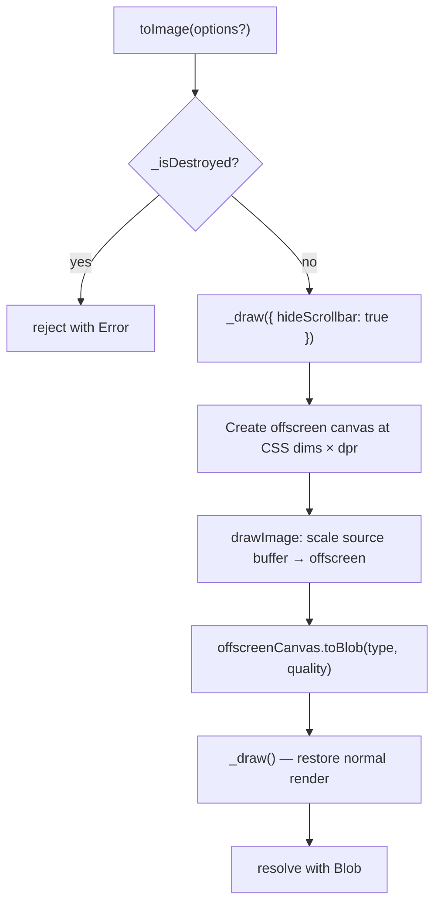

# Design Document: toImage

## Overview

The `toImage()` method adds image export capability to the `TempisTimeline` class. It captures the current visual state of the HTML5 Canvas as a `Blob` asynchronously via the `toBlob()` API. The method uses an offscreen canvas to render at the requested DPR, decoupling the export resolution from the device's display scaling. The async approach avoids blocking the main thread, which matters for large canvases (e.g., `grow-canvas` vertical fill mode with many items).

The implementation is intentionally minimal: a single async public method on `TempisTimeline`, an offscreen canvas for DPR-controlled rendering, and a new `_isDestroyed` flag to guard against post-destruction calls.

## Architecture

The feature touches only the `TempisTimeline` class. No new files or modules are introduced.



### Key design decisions

1. **Offscreen canvas for all exports** — We always create an offscreen canvas at `offsetWidth × dpr` by `offsetHeight × dpr` (where `dpr` defaults to 1). This keeps the code path simple and consistent regardless of whether the requested DPR matches the device DPR. The offscreen canvas draws the scaled source buffer, then `toDataURL()` runs on it.

2. **`_isDestroyed` flag** — The existing `destroy()` method tears down listeners and clears the canvas but does not set a flag. We add a private `_isDestroyed` boolean (defaulting to `false`, set to `true` at the top of `destroy()`) so that `toImage()` and potentially other future methods can guard against post-destruction use.

3. **Fresh render via `_draw()`** — Calling `_draw()` before capture guarantees the canvas reflects the latest timeline state. `_draw()` is already idempotent and fast, so the cost is negligible.

4. **Scrollbar suppression via draw options** — The `_draw()` method is extended to accept an optional options object with a `hideScrollbar` boolean. When `true`, the data view skips scrollbar rendering entirely. `toImage()` calls `_draw({ hideScrollbar: true })` for the capture frame, then calls `_draw()` again (no options) to restore the normal render. This avoids any state manipulation on the data view — the scrollbar visibility logic stays untouched.

5. **Async API via `toBlob()`** — `toBlob()` is non-blocking and returns a `Blob` via callback, which we wrap in a `Promise`. This avoids blocking the main thread for large canvases (especially in `grow-canvas` mode) and produces a memory-efficient `Blob` instead of a base64 string that's ~33% larger. Users who need a data URL can use `URL.createObjectURL(blob)` or read the blob with `FileReader`.

## Components and Interfaces

### Modified: `TempisTimeline` class (`src/TempisTimeline.ts`)

#### New private field

```typescript
/** Whether the timeline has been destroyed. */
private _isDestroyed: boolean = false;
```

#### New public method

```typescript
/**
 * Exports the current timeline view as an image Blob.
 *
 * @param options  Optional export settings.
 * @returns A Promise that resolves with the image Blob.
 * @throws Error if the timeline has been destroyed.
 */
public async toImage(options?: TempisTimelineImageOptions): Promise<Blob>
```

#### Modified: `destroy()` method

Set `this._isDestroyed = true` at the very beginning of the method body, before any cleanup logic.

#### Modified: `_draw()` method

Extend the signature to accept an optional options object:

```typescript
private _draw(options?: { hideScrollbar?: boolean }): void
```

When `options.hideScrollbar` is `true`, the `hideScrollbar` flag is passed through to the data view's `draw()` method, which skips the `_drawScrollbar()` call.

### Modified: `TimelineDataView.draw()` method (`src/TimelineDataView.ts`)

The `draw()` method is extended to accept an optional `hideScrollbar` boolean parameter. When `true`, the `_drawScrollbar()` call is skipped.

### No new files or modules

The entire feature lives inside `TempisTimeline`. A new `TempisTimelineImageOptions` interface is added to `TempisTimelineOptions.ts` and exported from `index.ts`.

### New type: `TempisTimelineImageOptions` (`src/TempisTimelineOptions.ts`)

```typescript
export interface TempisTimelineImageOptions {
    /** The image MIME type (e.g. "image/png", "image/jpeg", "image/webp"). Defaults to "image/png". */
    type?: string;
    /** A number between 0 and 1 for lossy formats (JPEG, WebP). Ignored for PNG. */
    quality?: number;
    /** The device pixel ratio for the exported image. Defaults to 1. Use values > 1 for higher resolution exports. */
    dpr?: number;
}
```

## Data Models

No new data models are introduced. The method operates on the existing `_canvas: HTMLCanvasElement` and returns a `Promise<Blob>`.

### Input parameters

| Parameter | Type | Default | Description |
|-----------|------|---------|-------------|
| `options.type` | `string?` | `"image/png"` | MIME type for the output image |
| `options.quality` | `number?` | `undefined` | Encoding quality (0–1) for lossy formats |
| `options.dpr` | `number?` | `1` | Device pixel ratio for the export. Output dimensions will be `offsetWidth × dpr` by `offsetHeight × dpr`. |

### Output

A `Promise<Blob>` — the Blob contains the encoded image data with the requested MIME type.


## Correctness Properties

*A property is a characteristic or behavior that should hold true across all valid executions of a system — essentially, a formal statement about what the system should do. Properties serve as the bridge between human-readable specifications and machine-verifiable correctness guarantees.*

### Property 1: Blob type matches requested image type

*For any* valid image MIME type from the set `{"image/png", "image/jpeg", "image/webp"}` (or no type option at all), calling `toImage({ type })` on a live timeline SHALL resolve with a `Blob` whose `type` property matches the requested type (defaulting to `image/png` when no type is provided).

**Validates: Requirements 1.1, 1.2, 5.1**

### Property 2: Quality parameter produces valid lossy output

*For any* quality value `q` in the range `[0, 1]` and any lossy image format (`image/jpeg` or `image/webp`), calling `toImage({ type: format, quality: q })` on a live timeline SHALL resolve with a valid `Blob` of that format type.

**Validates: Requirements 1.3**

### Property 3: Exported image dimensions match CSS pixel dimensions scaled by DPR

*For any* DPR value `d` (defaulting to 1) and any canvas with known CSS dimensions (`offsetWidth` × `offsetHeight`), calling `toImage({ dpr: d })` SHALL resolve with a `Blob` whose decoded image has width equal to `offsetWidth × d` and height equal to `offsetHeight × d`.

**Validates: Requirements 2.1, 2.2, 2.3**

### Property 4: Destroyed timeline rejects on toImage

*For any* `TempisTimeline` instance, if `destroy()` has been called, then calling `toImage()` SHALL throw an `Error` (synchronously, before the promise is created) with a message indicating the timeline has been destroyed.

**Validates: Requirements 4.1**

## Error Handling

| Scenario | Behavior |
|----------|----------|
| `toImage()` called after `destroy()` | Throws `Error` synchronously with descriptive message (e.g. `"Cannot export image: timeline has been destroyed."`) |
| `toImage()` called with unsupported MIME type | Delegates to `canvas.toBlob()` which falls back to `image/png` per the HTML spec. No error thrown. |
| `toImage()` called with quality outside 0–1 | Delegates to `canvas.toBlob()` which clamps or ignores invalid quality per browser implementation. No error thrown. |
| `toBlob()` callback receives `null` | The promise rejects with an `Error` indicating the image export failed. This can happen if the canvas is tainted or the browser cannot encode the requested format. |
| Canvas context unavailable | Extremely unlikely since the timeline already uses the context during construction and drawing. If it somehow occurs, `_draw()` would fail before `toImage()` reaches the export step. |

No new error types are introduced. The only explicit throw is the destroyed-timeline guard.

## Testing Strategy

### Testing framework

The project currently has no test runner configured. We recommend adding **Vitest** as the test runner and **fast-check** as the property-based testing library. Both are well-suited for TypeScript projects and require minimal configuration.

Since `toImage()` depends on `HTMLCanvasElement` and `CanvasRenderingContext2D`, tests will need a DOM environment. Vitest supports `jsdom` or `happy-dom` environments out of the box. However, `jsdom` does not implement `canvas.toDataURL()` natively — the `jest-canvas-mock` or `canvas` (node-canvas) package can be used to provide a working canvas implementation in tests.

### Unit tests

Unit tests should cover specific examples and edge cases:

- Calling `toImage()` with no arguments returns a string starting with `"data:image/png;base64,"`
- Calling `toImage("image/jpeg")` returns a string starting with `"data:image/jpeg;base64,"`
- Calling `toImage()` after `destroy()` throws an `Error`
- Calling `toImage()` triggers a fresh `_draw()` call (verified via spy)
- The `_isDestroyed` flag is `false` after construction and `true` after `destroy()`

### Property-based tests

Each correctness property above maps to a single property-based test using **fast-check**. Each test must run a minimum of 100 iterations.

Tests should be tagged with comments referencing the design property:

```
// Feature: to-image, Property 1: Data URL format matches requested image type
// Feature: to-image, Property 2: Quality parameter produces valid lossy output
// Feature: to-image, Property 3: Exported image dimensions match CSS pixel dimensions
// Feature: to-image, Property 4: Destroyed timeline throws on toImage
```

Property tests will generate:
- **Property 1**: Random image types from `{undefined, "image/png", "image/jpeg", "image/webp"}` and verify the data URL prefix
- **Property 2**: Random quality values in `[0, 1]` paired with lossy formats, verifying valid data URL output
- **Property 3**: Random DPR values (1, 1.5, 2, 3) with random CSS dimensions, verifying decoded image dimensions
- **Property 4**: Random timeline configurations, calling `destroy()` then `toImage()`, verifying the throw
